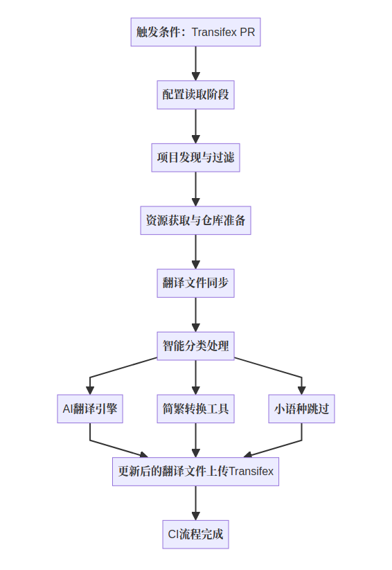
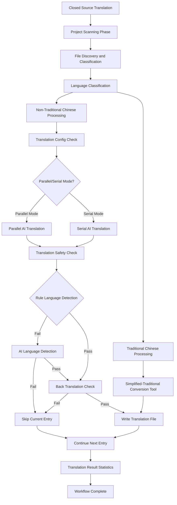

# deepin-auto-translation

Pre-fill untranslated strings in Qt Linguist TS files using Large Language Models (LLM) to assist translators.

Pre-filled strings will be marked with `type="unfinished"` attribute to remind translators that these contents need active review.

[^1]: The Transifex platform ignores strings marked as `type="unfinished"`, so we cannot retain this attribute for uploads to this platform.

**Important Note**: This project provides a set of scripts and tools for pre-filling translations in Qt projects. Since LLM results are not always accurate and reliable, it is recommended to use this tool under supervision.

## Features

- Automatic synchronization of translation file updates from Transifex platform (open source workflow)
- Support for multiple LLM translation services (DOUBAO, OPENAI, etc.)
- Rule-based matching for Traditional Chinese (zh_HK, zh_TW) translations, other languages use LLM translation except for specific minor languages
- **Smart Language File Management**: Automatically detect and create missing language files
- **Parallel Translation Processing**: Support multi-file parallel translation with configurable performance optimization
- **Translation Safety Validation**: Support back-translation verification, language detection, mixed language detection, and other validation modes
- **Language Attribute Fix**: Automatically fix incorrect language attributes in TS files
- **Translation Content Extraction**: Support extracting translation content for checking and analysis
- Submit translation results to sync with Transifex platform (open source workflow)

## Open Source Project Translation Workflow

### Prerequisites: Project Transifex Configuration

### Install Transifex

```bash
# Install Transifex CLI
curl -o- https://raw.githubusercontent.com/transifex/cli/master/install.sh | bash
sudo apt install transifex-client

# Configure Transifex authentication (create ~/.transifexrc file)
[https://www.transifex.com]
rest_hostname = https://rest.api.transifex.com
api_hostname = https://api.transifex.com
hostname = https://www.transifex.com
token = YOUR_TRANSIFEX_API_TOKEN

# Verify installation
tx --version
```

Before using the auto-translation tool, the project must have Transifex integration configured. The project needs to include the following configuration files:

1. **`.tx/config` file**: Transifex CLI configuration file that defines resource mappings, for example:
   
   ```ini
   [main]
   host = https://www.transifex.com
   
   [o:linuxdeepin:p:project-name:r:resource-name]
   file_filter = translations/project_<lang>.ts
   source_file = translations/project_en.ts
   source_lang = en
   type = QT
   ```
   
2. **`.transifex.yml` file**: Transifex platform configuration file for workflow automation, for example:
   
   ```yaml
   git:
     filters:
       - filter_type: file
         file_format: QT
         source_file: translations/project_en.ts
         source_language: en
         translation_files_expression: 'translations/project_<lang>.ts'
   settings:
     pr_branch_name: 'transifex-translations'
   ```

**How to Configure Transifex Integration**:
- Reference: [Internationalization Configuration Process](https://wikidev.uniontech.com/%E6%96%87%E6%A1%88%E5%9B%BD%E9%99%85%E5%8C%96%E9%85%8D%E7%BD%AE%E6%B5%81%E7%A8%8B)
- Project Integration: [Project Transifex Internationalization](https://wikidev.uniontech.com/%E9%A1%B9%E7%9B%AE%E5%88%A9%E7%94%A8Transifex%E5%9B%BD%E9%99%85%E5%8C%96)
- Sync Configuration: [Transifex Translation Sync Configuration Guide](https://wikidev.uniontech.com/Transifex%E7%BF%BB%E8%AF%91%E5%90%8C%E6%AD%A5%E9%85%8D%E7%BD%AE%E6%8C%87%E5%8D%97)
- Tool Usage: [Deepin-translation-utils Usage Guide](https://wikidev.uniontech.com/Deepin-translation-utils%E4%BD%BF%E7%94%A8%E8%AF%B4%E6%98%8E) (can be used to generate corresponding project config and transifex.yaml files)

Before use, make sure to test with the tx command to verify if the configuration is successful, otherwise subsequent code updates won't work. (For example, use `tx pull -a` to pull the latest translations from the Transifex platform)

### Project Configuration Files Introduction

In the open source project translation workflow, besides the above Transifex integration configuration, the following project-level configuration files are needed to control the translation tool's behavior:

1. **config.yml**: Configure Transifex organization information

   ```yaml
   transifex:
     organization: 'o:linuxdeepin'
   ```

   **Purpose**:

   - Specify the Transifex organization for the translation tool to connect to
   - CI process reads this configuration to get the list of all projects in the organization
   - Ensure the translation tool connects to the correct Transifex organization account

2. **transifex-projects.yml**: Project list configuration file (auto-generated)

   ```yaml
   - 'o:linuxdeepin:p:deepin-desktop-environment'
   - 'o:linuxdeepin:p:deepin-file-manager'
   - 'o:linuxdeepin:p:deepin-calculator'
   ```

**Purpose**:

- **Project List Configuration**: Contains the list of Transifex project IDs to process
- **Auto-generation**: In CI process, the pipeline will read the organization name and project name from the PR (triggering /test deepin-auto-translation) and populate transifex-projects.yml
- **Manual Configuration**: Users can edit this file to add projects to be processed to extend the translation tool's processing scope

**How Configuration Files Work**:

- When CI process starts, it first reads `config.yml` to get organization information
- Checks if `transifex-projects.yml` file exists:
  - If it exists and is not empty, uses the project list directly
  - If it doesn't exist or is empty, gets all projects from Transifex API and auto-generates this file
- Users can edit `transifex-projects.yml` anytime to adjust the scope of projects to be processed
- Subsequent steps read project information from `transifex-projects.yml` to get associated GitHub resources

### Usage

1. **Update Source Files in Local Repository**  
   First, you need to merge updates containing `_en.ts`, `_en_us.ts`, `zh_CN.ts`, `*.ts` source files (refer to the source files configured in .tx) in the project's local repository. These files should be updated according to the project's `.tx/config` and `.transifex.yml` configuration, then committed to GitHub and merged into the main branch.

2. **Transifex Automatic Change Detection**  
   The Transifex platform automatically monitors the GitHub repository and detects changes in translation source files, analyzing changes in translation completion rate (default PR trigger condition is 50% change, you can contact Wang Zichong to change this value).

3. **Transifex Triggers Sync PR**  
   After detecting changes, Transifex automatically creates a sync Pull Request to the GitHub project. The PR title format is usually:

   `[project-name] Updates for project Project Name #123`

4. **Start Auto Translation**  
   In the PR created by Transifex, use the following command to trigger auto translation:

   ```bash
   /test deepin-auto-translation
   ```

   Note: If the pipeline fails, you can use:

   ```bash
   /retest
   ```
   
   to restart
   
   **Reference: https://github.com/linuxdeepin/deepin-draw/pull/150**
   
5. **View Translation Results**  
   You can view specific translation details and logs in the CI execution results, for example:
   [CI Execution Example](https://prow.cicd.getdeepin.org/view/s3/prow-logs/pull/linuxdeepin_deepin-draw/143/deepin-auto-translation/1927888385188302848)

### Workflow Details

The open source project translation workflow is the main feature of this tool, specifically designed for handling public projects integrated with GitHub and Transifex platforms. The process is fully automated and supports CI/CD integration.

#### Workflow Overview



#### CI Execution Detailed Steps

> **Note**: CI configuration is based on the [deepin-auto-translation/test](https://github.com/linuxdeepin/deepin-auto-translation/tree/develop/test) branch. Other projects need to modify the corresponding yaml configuration files based on this branch to run CI.

**Step 1: Read Configuration and Project List**  

- Read `config.yml` to get Transifex organization information
- Check if `transifex-projects.yml` configuration file exists:
  - If it exists and is not empty, use its project list directly
  - If it doesn't exist or is empty, get all projects from Transifex API and auto-generate this file

**Step 2: Project Resource Retrieval**  
- Use the final project list to get all projects' associated GitHub repository resources

**Step 3: Local Repository Preparation**  
- Automatically clone or update local repository to `repo/` directory
- Use `tx pull --all --force` to pull latest translation files from Transifex

**Step 4: Translation File Processing**  
- Automatically scan and check all translation files, identify files containing untranslated content
- Smart classification processing:
  - **Traditional Chinese Files** (zh_HK, zh_TW): Use rule-based matching method
  - **Minor Language Files** (like German, Japanese, etc.): Skip script processing
  - **Other Languages**: Use AI large models for translation

**Step 5: Upload Translation Results**  
- Upload translated ts files to Transifex platform via `tx push`

### Notes

- **Free Model Limitations**: Currently using free models for translation, translation quality may be less than ideal.
- **Transifex Platform Status**: The Transifex platform occasionally experiences slow responses causing API call failures, recommend retrying later, but probability is very low.
- **CI Execution Failure Handling**: CI sometimes fails due to slow network speed, in such cases use /retest to restart the pipeline.
- It's recommended to use Squash merge for project PRs, otherwise there will be many commit records in git log.

## Closed Source Project Translation Workflow

### Environment Preparation

#### **Install Bun Runtime Environment**

Bun is a JavaScript runtime environment designed to provide faster execution speed and more efficient resource management than existing solutions (like Node.js). Additionally, for small script tasks that need to be written and executed quickly, Bun provides a lightweight and efficient option. Whether it's file system operations, network requests, or other I/O operations, Bun can provide excellent performance.

Official website: https://bun.sh/

Installation steps:

```bash
# Install bun, some environments may not be able to install bun with this command
# Note: If installation fails, go to https://github.com/oven-sh/bun/releases to find installation package and manually install then configure path in bashrc, ensure Bun is in our path
curl -fsSL https://bun.sh/install | bash

# Add to PATH (add following content to ~/.bashrc), if using curl -fsSL https://bun.sh/install | bash then find bun command under /home/uos/.bun/bin, manual installation also recommended to follow this path
export BUN_INSTALL="$HOME/.bun"
export PATH="$BUN_INSTALL/bin:$PATH"

# Reload configuration
source ~/.bashrc

# Verify installation
bun --version
```

#### **Configure Transifex**

Open source projects can also use the closed source project workflow for translation and upload. For projects that have done platform synchronization, it's recommended to do tx pull to update the latest translations first.

```bash
# Install Transifex CLI
curl -o- https://raw.githubusercontent.com/transifex/cli/master/install.sh | bash
sudo apt install transifex-client

# Configure Transifex authentication (create ~/.transifexrc file)
[https://www.transifex.com]
rest_hostname = https://rest.api.transifex.com
api_hostname = https://api.transifex.com
hostname = https://www.transifex.com
token = YOUR_TRANSIFEX_API_TOKEN

# Verify installation
tx --version
```

#### Local AI Translation Deployment

Replace the secrets.sample.ts file in the project root directory with secrets.ts, and add corresponding large model API key information and Model information:

```typescript
// SPDX-FileCopyrightText: 2024 UnionTech Software Technology Co., Ltd.
//
// SPDX-License-Identifier: CC0-1.0
export const doubao = {
    model: 'xxxxxxxxxxxxxxxxxxxxxxxxxxxxxx',
    accessKey: 'xxxxxxxxxxxxxxxxxxxxxxxxxxxxxxxxxxxxx'
};

export const openai = {
    accessKey: 'xxxxxxxxxxxxxxxxxxxxxxxxxxxxxx'
};

export const transifex = {
    accessKey: 'xxxxxxxxxxxxxxxxxxxxxxxxxxxxxx'
}

export default {doubao, openai, transifex};
```

##### Introduction to Getting Large Model API Keys and Models:

**Note: The APIs in the examples are expired keys, only for demonstration purposes.**

##### Introduction to Using Volcano Engine to Call Doubao API:

Login to Volcano Ark homepage https://www.volcengine.com/product/ark, register an account and login:

[Image instructions for Volcano Engine setup]

##### Introduction to Using Silicon Flow Large Model API:

Silicon Flow (SiliconFlow) provides a series of API interfaces allowing developers to call its large models for various AI tasks, including dialogue generation, text processing, image generation, speech and video processing, etc.

1.**Registration and Login**:

- Users need to visit Silicon Flow's official website (https://cloud.siliconflow.cn/models) and complete registration, usually through mobile phone verification code.

[Detailed instructions for Silicon Flow setup]

##### **Transifex API Key** Configuration Introduction:

We don't need to apply for this key ourselves, it's directly available on the wiki:

https://wikidev.uniontech.com/%E9%A1%B9%E7%9B%AE%E5%88%A9%E7%94%A8Transifex%E5%9B%BD%E9%99%85%E5%8C%96 see step 3

### Usage

Run the following command directly to start the translation process:
```shell
$ bun closed-source.ts /path/to/project [options]
```

### Command Parameters

- **Project Path** (Required): Project directory path containing translation files
- **File List** (Optional): Specify specific translation files to process
- **--exclude** (Optional): Skip specified files, can be used multiple times
- **--languages** (Optional): Specify list of languages to translate, comma separated
- **--extract-only** (Optional): Only extract translation content, don't execute translation
- **--ensure-languages** (Optional): Only detect and create missing language files, don't execute translation
- **--auto-create** (Optional): Automatically create missing language files and execute translation

#### Usage Examples

```bash
# Translate all unfinished translation files in the project
bun closed-source.ts /path/to/project

# Only translate specific files
bun closed-source.ts /path/to/project app_en.ts xx_fr.ts xx_ru.ts

# Translate all files but exclude specified translation files
bun closed-source.ts /path/to/project --exclude xx_zh_CN.ts --exclude xx_en.ts

# Only translate specified languages
bun closed-source.ts /path/to/project --languages zh_CN,en,fr

# Only extract translation content for checking, don't execute translation
bun closed-source.ts /path/to/project --extract-only

# Only detect and create missing language files (safe operation)
bun closed-source.ts /path/to/project --ensure-languages

# Automatically create missing language files and execute translation
bun closed-source.ts /path/to/project --auto-create
```

### Smart Language File Management

Automatically detect missing language files in the project and create standard format TS files for missing languages.

**Features**:
- Support automatic creation for 52 languages

[List of supported languages]

- Only create missing files, don't modify existing files

**Usage**:
```bash
# Only create missing language files
bun closed-source.ts /path/to/project --ensure-languages

# Create missing files and execute translation
bun closed-source.ts /path/to/project --auto-create
```

### Parallel Translation Processing

Support multi-file parallel translation, optimize translation performance through reasonable configuration.

**Configuration Method**: Choose preset configuration through environment variable `TRANSLATION_PARALLEL_CONFIG`:

```bash
# Standard configuration (default)
export TRANSLATION_PARALLEL_CONFIG=standard
bun closed-source.ts /path/to/project

# Performance configuration (high concurrency)
export TRANSLATION_PARALLEL_CONFIG=performance
bun closed-source.ts /path/to/project

# Conservative configuration (avoid API limits)
export TRANSLATION_PARALLEL_CONFIG=conservative
bun closed-source.ts /path/to/project
```

**Configuration Comparison**:

| Config | File Concurrency | Batch Size | API Limit | Features |
|--------|-----------------|------------|-----------|-----------|
| standard | 3 | 15 | 3/1s | Balance speed and stability |
| performance | 5 | 15 | 5/1s | Maximize translation speed |
| conservative | 1 | 15 | 1/2s | Serial processing but optimize speed |

### Translation Safety Validation

Configure through environment variable `VALIDATION_CONFIG`. When translation safety validation is enabled, it will first detect based on Unicode characters, if detection fails it will use AI for secondary verification. If language detection fails, skip current translation, if passes then use large model for back translation and let the large model judge if the back translation and original text have similar meanings:

```bash
# Default configuration (Rules + AI language detection)
export VALIDATION_CONFIG=default
bun closed-source.ts /path/to/project

# Disable validation
export VALIDATION_CONFIG=disabled
bun closed-source.ts /path/to/project
```

### Workflow Details

The closed source project translation workflow is specifically designed for handling private projects that cannot be directly integrated with GitHub and Transifex platforms.

#### Workflow Overview



#### Processing Steps

[Detailed processing steps]

### Differences from Open Source Project Translation Workflow

| Feature | Open Source Project Translation Workflow | Closed Source Project Translation Workflow |
|---------|----------------------------------------|------------------------------------------|
| **Trigger Method** | GitHub PR + CI Comment | Local Command Line |
| **Data Source** | Transifex Platform + GitHub | Local File System |
| **Configuration Dependencies** | `.tx/config`, `.transifex.yml` | No Configuration Files Required |
| **Platform Integration** | Fully Automated CI/CD | No Platform Dependencies |
| **Result Output** | Auto Upload and Create PR | Local File Update |
| **Use Cases** | Public Open Source Project CI/CD | Private Closed Source Project Local Processing |

## Resources and Links

### Technical Documentation
- [Qt Linguist TS File Format XSD](https://doc.qt.io/qt-6/linguist-ts-file-format.html)
- [OpenAI Completions API](https://platform.openai.com/docs/api-reference/chat)
  - [VolcEngine: ChatCompletions API](https://www.volcengine.com/docs/82379/1298454)
  - [vLLM: Structured Outputs](https://docs.vllm.ai/en/latest/usage/structured_outputs.html)
  - [OpenAI Chat Completions: Structured Outputs](https://platform.openai.com/docs/guides/structured-outputs?api-mode=chat&example=chain-of-thought)
- [Ollama API#Structured outputs](https://github.com/ollama/ollama/blob/main/docs/api.md#request-structured-outputs)
- [Transifex OpenAPI](https://transifex.github.io/openapi/)

### Transifex Configuration Reference Documentation
- [Internationalization Configuration Process](https://wikidev.uniontech.com/%E6%96%87%E6%A1%88%E5%9B%BD%E9%99%85%E5%8C%96%E9%85%8D%E7%BD%AE%E6%B5%81%E7%A8%8B)
- [Project Transifex Internationalization](https://wikidev.uniontech.com/%E9%A1%B9%E7%9B%AE%E5%88%A9%E7%94%A8Transifex%E5%9B%BD%E9%99%85%E5%8C%96)
- [Transifex Translation Sync Configuration Guide](https://wikidev.uniontech.com/Transifex%E7%BF%BB%E8%AF%91%E5%90%8C%E6%AD%A5%E9%85%8D%E7%BD%AE%E6%8C%87%E5%8D%97)
- [Transifex-cli Usage Guide](https://wikidev.uniontech.com/Transifex-cli)
- [Deepin-translation-utils Usage Guide](https://wikidev.uniontech.com/Deepin-translation-utils%E4%BD%BF%E7%94%A8%E8%AF%B4%E6%98%8E) (Project configuration file auto-generation tool)