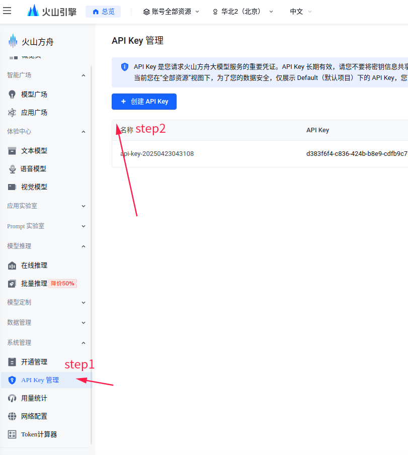
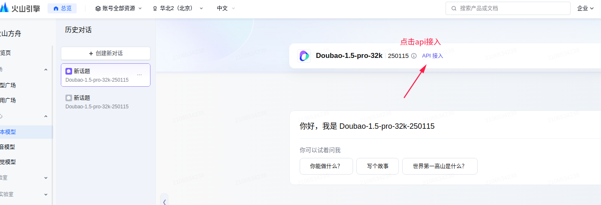
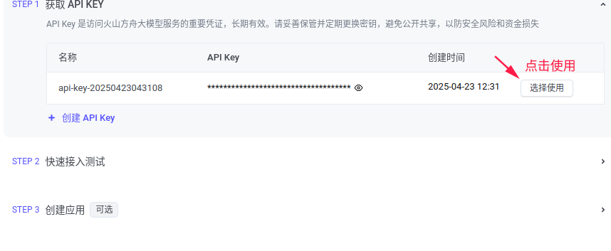
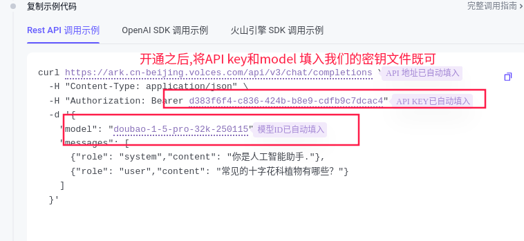
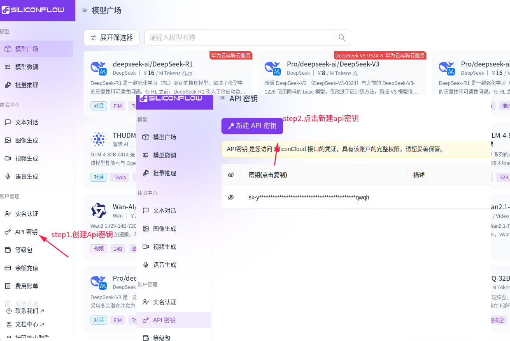
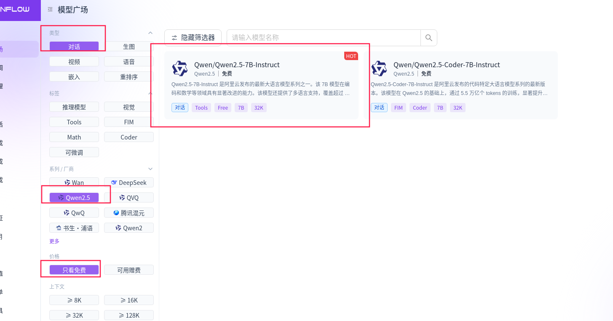
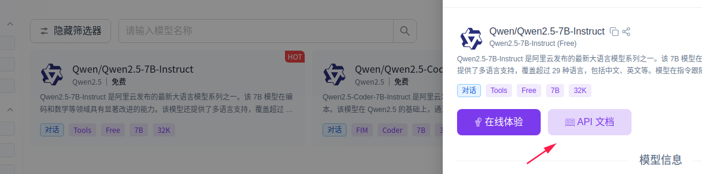
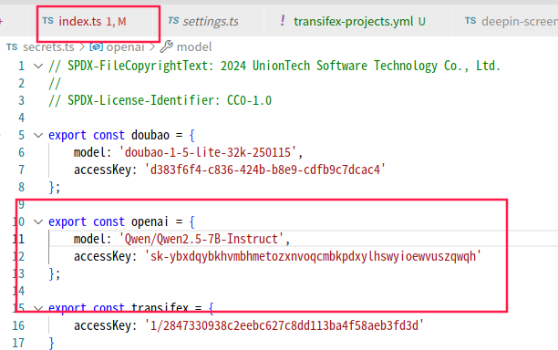

# deepin-auto-translation

Pre-fill untranslated strings in Qt Linguist TS files using LLM, before translators get involved.

Pre-filled strings can be marked with an `type="unfinished"` attribute, so translators will know these strings need to be actively reviewed.[^1]

[^1]: Transifex platform will ignore strings marked with `type="unfinished"`, so for uploading purposes we cannot keep this attribute.

Important note: This project provides a set of scripts and utility functions for pre-filling translations for Qt-based projects. Since the results returned by LLMs are not always correct and reliable, it's still recommended to use this tool under supervision.

## Features

- Automatically detects if the latest commit in a Git repository meets the script's startup requirements (supports detecting specific commits that contain "transfix" in the title and include source files (xx_en.ts/xx_en_us.ts); if not met, it will perform translation processing for specific files based on current ts files)
- Automatically synchronizes translation file updates from the Transifex platform
- Supports multiple LLM translation services (DOUBAO, OPENAI, etc.)
- Special handling for Traditional Chinese (zh_HK, zh_TW) translations using rule-based matching
- Supports automatic creation of missing language translation files
- Submits translation results synchronized to the Transifex platform (due to local simulation, there's also a git commit process)

## Environment Setup

### Basic Environment

1. **Configure Git User Information**

```bash
sudo apt install git
git config --global user.name "Your Name"
git config --global user.email "your.email@example.com"

# Configure gerrit SSH key:
ssh-keygen -t rsa -C "your.email@example.com", press enter three times
```

Copy the content of ~/.ssh/id_rsa.pub file to your SSH and GPG keys (used for secure passwordless authentication when performing Git operations with GitHub repositories such as pushing code, pulling code, etc.).


2. **Install bun Runtime Environment**

Bun is a JavaScript runtime environment designed to provide faster execution speed and more efficient resource management than existing solutions (such as Node.js). Additionally, for small script tasks that need to be written and executed quickly, Bun provides a lightweight and efficient choice. Whether it's file system operations, network requests, or other I/O operations, Bun can provide excellent performance.

Official website: https://bun.sh/

Installation steps:

```bash
# Install bun
# Note: If installation fails, go to https://github.com/oven-sh/bun/releases to find installation packages and manually install, then configure the path to bashrc to ensure Bun is in our PATH
curl -fsSL https://bun.sh/install | bash

# Add to PATH (add the following content to ~/.bashrc)
export BUN_INSTALL="$HOME/.bun"
export PATH="$BUN_INSTALL/bin:$PATH"

# Reload configuration
source ~/.bashrc

# Verify installation
bun --version
```

3. **Install and Configure Transifex CLI**

```bash
# Install Transifex CLI
curl -o- https://raw.githubusercontent.com/transifex/cli/master/install.sh | bash
sudo apt install transifex-client

# Configure Transifex authentication (create ~/.transifexrc file)
[https://www.transifex.com]
rest_hostname = https://rest.api.transifex.com
api_hostname = https://api.transifex.com
hostname = https://www.transifex.com
token = YOUR_TRANSIFEX_API_TOKEN

# Verify installation
tx --version
```

4. **Clone Project and Install Dependencies**

Note: Open source projects with configured yaml files will automatically pull, refer to the corresponding sections for specific workflow

```bash
git clone [project-repo]
cd deepin-auto-translation
bun install
```

### API Key Configuration

Copy `secrets.sample.ts` to `secrets.ts` and fill in the necessary API keys:

```typescript
export const doubao = {
    model: 'your_doubao_model_id',  // e.g.: doubao-1-5-lite-32k-250115
    accessKey: 'your_doubao_access_key'
};

export const openai = {
    accessKey: 'your_openai_key'  // Or SiliconFlow and other OpenAI API compatible service keys
};

export const transifex = {
    accessKey: 'your_transifex_access_key'  // e.g.: 1/xxxxxxxxxxxx
}
```

#### Local AI Translation Deployment

Replace the secrets.sample.ts file in the project root directory with secrets.ts, and add the corresponding LLM API key information and Model information:

```c++
// SPDX-FileCopyrightText: 2024 UnionTech Software Technology Co., Ltd.
//
// SPDX-License-Identifier: CC0-1.0
export const doubao = {
    model: 'xxxxxxxxxxxxxxxxxxxxxxxxxxxxxx',
    accessKey: 'xxxxxxxxxxxxxxxxxxxxxxxxxxxxxxxxxxxxx'
};

export const openai = {
    accessKey: 'xxxxxxxxxxxxxxxxxxxxxxxxxxxxxx'
};

export const transifex = {
    accessKey: 'xxxxxxxxxxxxxxxxxxxxxxxxxxxxxx'
}

export default {doubao, openai, transifex};
```

##### Methods for Obtaining LLM API Keys and Models:

**Note: The APIs in the examples are all expired keys, only for demonstration purposes.**

##### VolcEngine Doubao API Configuration Method:

Login to VolcEngine Ark homepage https://www.volcengine.com/product/ark, register an account and login:


After logging into the homepage, select API to build applications:


Create API key:



After creation, click on the model marketplace in the left navigation bar, select the model we want to use. For translation, we use language dialogue models:


After entering the LLM usage interface, click API access:



First get the API KEY we created earlier:



After clicking use, you will select the access model, choose according to your needs:


After activating the model, follow the step instructions and fill the API key and model into the secrets.ts file:




##### SiliconFlow LLM API Configuration:

SiliconFlow provides a series of API interfaces that allow developers to call its large language models for various artificial intelligence tasks, including dialogue generation, text processing, image generation, voice and video processing, etc.

1. **Registration and Login**:

- Users need to visit SiliconFlow's official website (https://cloud.siliconflow.cn/models) and complete registration, usually through mobile phone verification code.

2. **API Key Management**:

- In the SiliconFlow platform, users need to create API keys, which is a necessary step for calling APIs. After creating API keys, they should be saved immediately, because in some cases, keys may not be viewable again after creation.
- API key generation can be completed on the API management page of the user account, supporting adding descriptions.



3. After creating the key, select the model marketplace in the main menu navigation bar, you can click filter to select the model you need:



After clicking to enter the model interface, click the API documentation button and save the model:




4. Calling SiliconFlow API

All models in SiliconFlow can be called through API, but if you want to recharge, you need real-name authentication to recharge your account (because some models are paid to use, so you need to recharge). The API calling method (taking QWen2.5 model as an example), copy the api key generated in step 2 and the model name we selected in step 3 to the secrets.ts file for script calling:



**Transifex API Key** Configuration:
- This key doesn't need to be applied for separately, it's directly available on the wiki:

https://wikidev.uniontech.com/Project_Using_Transifex_Internationalization see step 3

## Project File Structure Introduction

Before diving into specific workflows, here's an overview of the main files and their purposes:

### Core Files

- **`index.ts`** - Main entry point for open source project workflow, handles CI automation and project coordination
- **`closed-source.ts`** - Standalone workflow for closed source projects, provides command-line interface
- **`check-ts-files.ts`** - File discovery and classification engine, scans repositories for translation files

### Translation Engine

- **`translator.ts`** - Core translation orchestrator, handles batch processing and file management
- **`openai.ts`** - OpenAI-compatible API integration (primary translation service)
- **`doubao.ts`** - VolcEngine Doubao API integration (alternative translation service)
- **`ollama.ts`** - Local Ollama model integration (self-hosted option)

### Platform Integration

- **`transifex.ts`** - Transifex platform API client, handles resource management and upload/download
- **`gitrepo.ts`** - Git repository management, handles cloning and local repository operations
- **`qtlinguist.ts`** - Qt Linguist TS file parser and generator, handles XML manipulation

### Configuration & Utilities

- **`settings.ts`** - Model configuration and system settings
- **`secrets.ts`** - API keys and authentication credentials (user-created)
- **`types.ts`** - TypeScript type definitions and interfaces
- **`prompt.ts`** - Translation prompt templates and localization rules

### Data Files

- **`config.yml`** - Transifex organization configuration
- **`project-list.yml`** - Optional project filtering list
- **`transifex-projects.yml`** - Auto-generated project resource mapping
- **`language.yml`** - Language code mapping and metadata (if exists)

### External Dependencies

- **`deepin-translation-utils`** - Binary tool for Traditional Chinese conversion (Simplified ↔ Traditional)

## Open Source Project Translation Workflow

### Prerequisites: Project Transifex Configuration

Before using the automatic translation tool, projects must have Transifex integration configured. Projects need to include the following configuration files:

1. **`.tx/config` file**: Transifex CLI configuration file that defines resource mappings, for example:
   
   ```ini
   [main]
   host = https://www.transifex.com
   
   [o:linuxdeepin:p:project-name:r:resource-name]
   file_filter = translations/project_<lang>.ts
   source_file = translations/project_en.ts
   source_lang = en
   type = QT
   ```
   
2. **`.transifex.yml` file**: Transifex platform configuration file for automated workflows, for example:
   
   ```yaml
   git:
     filters:
       - filter_type: file
         file_format: QT
         source_file: translations/project_en.ts
         source_language: en
         translation_files_expression: 'translations/project_<lang>.ts'
   settings:
     pr_branch_name: 'transifex-translations'
   ```

**How to configure Transifex integration**:
- Reference documentation: [Internationalization Configuration Process](https://wikidev.uniontech.com/Internationalization_Configuration_Process)
- Project integration: [Project Using Transifex Internationalization](https://wikidev.uniontech.com/Project_Using_Transifex_Internationalization)
- Sync configuration: [Transifex Translation Sync Configuration Guide](https://wikidev.uniontech.com/Transifex_Translation_Sync_Configuration_Guide)
- Tool usage: [Deepin-translation-utils Usage Guide](https://wikidev.uniontech.com/Deepin-translation-utils_Usage_Guide) (can be used to generate corresponding project config and transifex.yaml files)

Before use, it's recommended to test whether the configuration is successful with tx commands (e.g., tx pull -a to pull the latest translations from the Transifex platform).

### Project Configuration Files

In the open source project translation workflow, in addition to the above Transifex integration configuration, the following project-level configuration files are also needed to control the behavior of the translation tool:

1. **config.yml**: Configure Transifex organization information

   ```yaml
   transifex:
     organization: 'o:linuxdeepin'
   ```
   
   **Purpose**:
   - Specify the Transifex organization that the translation tool should connect to
   - The CI process will read this configuration to get the list of all projects under the organization
   - Ensure the translation tool connects to the correct Transifex organization account

2. **project-list.yml**: Contains a list of Transifex project IDs to be processed (optional)
   ```yaml
   projects:
      - 'o:linuxdeepin:p:deepin-desktop-environment'
      - 'o:linuxdeepin:p:deepin-file-manager'
   ```
   
   **Purpose**:
   - Limit the translation tool to only process the specified project list, rather than all projects under the organization
   - If this file doesn't exist, the tool will automatically process all projects under the organization
   - Provides project-level fine control, suitable for scenarios requiring batch processing or specific project processing
   - Project ID format follows Transifex's organization-project hierarchy structure

**Configuration File Working Principle**:
- When the CI process starts, it first reads `config.yml` to get organization information
- Get all projects under that organization through the Transifex API
- If `project-list.yml` exists, filter out the specified projects for processing
- This design supports both full processing and precise control of specific project translation workflows

### Usage Steps

1. **Update Source Files in Local Repository**  
   First need to merge updates containing `_en.ts` and `zh_CN.ts` source files in the project's local repository. These files should be updated according to the project's `.tx/config` and `.transifex.yml` configuration, then committed to GitHub and merged into the main branch

2. **Transifex Automatic Change Detection**  
   The Transifex platform will automatically monitor the GitHub repository, and after detecting changes in translation source files, it will analyze changes in translation completion (default translation PR trigger condition is 50% change, you can contact Wang Zichong to change this value)

3. **Transifex Triggers Sync PR**  
   After detecting changes, Transifex will automatically create a sync Pull Request to the GitHub project. The PR title format is usually: `[project-name] Updates for project Project Name #123`

4. **Start Automatic Translation**  
   In the PR created by Transifex, use the following command to trigger automatic translation:
   
   ```bash
   /test deepin-auto-translation
   ```
   
   Reference: https://github.com/linuxdeepin/deepin-draw/pull/150

5. **View Translation Results**  
   You can view specific translation details and logs in CI execution results, for example:
   [CI Execution Example](https://prow.cicd.getdeepin.org/view/s3/prow-logs/pull/linuxdeepin_deepin-draw/143/deepin-auto-translation/1927888385188302848)

### Workflow Detailed Explanation

The open source project translation workflow is the main functionality of this tool, specifically designed to handle public projects integrated with GitHub and Transifex platforms. This workflow is fully automated and supports CI/CD integration.

#### Workflow Overview


#### CI Execution Detailed Steps

> **Note**: CI configuration is based on [deepin-auto-translation/test](https://github.com/linuxdeepin/deepin-auto-translation/tree/develop/test) branch. Other projects that need to run CI should modify the corresponding yaml configuration files based on this branch.

**Step 1: Read Configuration and Project List**  
- Read `config.yml` to get Transifex organization information
- Read `project-list.yml`, if it doesn't exist, process all projects
- Get all project lists from Transifex API for the specified organization

**Step 2: Project Filtering and Resource Acquisition**  
- Filter projects according to `project-list.yml` (if specified)
- Generate and update `transifex-projects.yml` file
- Get associated GitHub repository resources for all projects

**Step 3: Local Repository Preparation**  
- Automatically clone or update local repositories to `repo/` directory
- Use `tx pull --all --force` to pull latest translation files from Transifex

**Step 4: Translation File Processing**  
- Automatically scan and check all translation files, identify files containing untranslated content
- Intelligent classification processing:
  - **Traditional Chinese files** (zh_HK, zh_TW): Process using rule-based matching
  - **Minor language files** (such as German, Japanese, etc.): Skip, not processed by script
  - **Other languages**: Use AI large language models for translation

**Step 5: Upload Translation Results**  
- Upload translated ts files to Transifex platform via `tx push` method

#### Technical Implementation Features

- **Fully Automated**: Complete process from repository cloning to result upload without human intervention
- **Intelligent Language Recognition**: Automatically distinguish different languages and adopt the most suitable processing strategy  
- **Batch Processing Optimization**: Support parallel processing of multiple projects to improve efficiency
- **Error Recovery Mechanism**: Automatic retry for network exceptions and API limitations
- **State Persistence**: Support resumption from breakpoints after interruption

### Notes

- **Free Model Limitations**: Currently using free models for translation, the effect may not be ideal, and some content may appear with translation errors (the script has skip processing). It's recommended to use paid models in production environments to improve translation quality (additionally, SiliconFlow has 12 yuan free credit per account that can be used, most projects' first iteration involves large volumes, so paid models are recommended for better results).

- **Retry Mechanism**: Some languages may fail when executing `tx push`, in which case re-executing the CI process once can solve the issue.

- **Transifex Platform Status**: Transifex platform occasionally experiences slow response, causing API call failures. It's recommended to retry later.

- **CI Configuration Notes**: CI configuration is based on [deepin-auto-translation/test](https://github.com/linuxdeepin/deepin-auto-translation/tree/develop/test) branch. Other projects that need to run CI should modify the corresponding yaml configuration files based on this branch.

- **CI Execution Recommendations**: During initial execution, due to the large amount of content, failures may occur when running multiple project CIs simultaneously. It's recommended to execute CI in the evening for higher success rates.

- Remember to use Squash merge when merging project PRs, otherwise there will be many commit records in git log.

- Since AI translation of Chinese may have ambiguities, leading to deviations in traditional Chinese translation, this is why it's required to ensure Chinese translation is completed before using the script.

## Closed Source Project Translation Workflow

### Usage Method

Run the following command directly to start the translation process:
```shell
$ bun closed-source.ts /path/to/project [optional-file-list] [--exclude pattern]
```

### Command Parameters

- **Project Path** (required): Project directory path containing translation files
- **File List** (optional): Specify specific translation files to process
- **Exclude Pattern** (optional): Use `--exclude` to skip matching files or directories

#### Usage Examples

```bash
# Translate all unfinished translation files in the project
bun closed-source.ts /path/to/project

# Only translate specific files
bun closed-source.ts /path/to/project app_en.ts xx_fr.ts xx_ru.ts

# Translate all files but exclude specified translation files
bun closed-source.ts /path/to/project --exclude xx_zh_CN.ts --exclude xx_en.ts
```

### Workflow Detailed Explanation

The closed source project translation workflow is specifically designed to handle private projects that cannot directly integrate with GitHub and Transifex platforms.

#### Workflow Overview


#### Processing Steps

**Step 1: Project Scanning**
- Recursively scan project directory to find all `.ts` translation files
- Identify translation files conforming to naming conventions: `*_language_code.ts`
- Apply exclusion rules, skip files that don't need processing

**Step 2: Language Recognition and Classification**
- Extract language codes from filenames (such as `zh_CN`, `en`, `fr`, etc.)
- Use XML DOM parser to check file content, only process entries marked as `type="unfinished"` with empty content
- Intelligent classification:
  - **AI Translation Languages**: English, Russian, French, Arabic, etc.
  - **Traditional Chinese Languages**: zh_HK (Hong Kong), zh_TW (Taiwan)
  - **Minor Language Skip**: German, Japanese, Spanish, etc.

**Step 3: Translation Processing**
- **Non-Traditional Chinese files**: Use AI large language models for individual translation, batch processing (30 entries per batch)
- **Simplified Chinese files**: Record file paths to provide source files for traditional Chinese conversion
- **Traditional Chinese files**: Use `deepin-translation-utils` tool for simplified-traditional conversion

**Step 4: Result Statistics**
- Real-time display of processing progress: `[Current/Total] Processing: Filename`
- Generate detailed statistical reports, including successful, failed, and skipped file counts

#### Technical Features

- **No Platform Dependencies**: Complete local processing, no network connection to specific platforms required
- **Intelligent Language Processing**: Different languages adopt the most suitable processing strategies
- **Serial Processing Design**: Avoid API rate limits, improve translation stability
- **Error Recovery Mechanism**: Automatic retry and detailed error logs
- **File Security Protection**: Preserve original XML format, backup mechanism ensures data safety

### Differences from Open Source Project Translation Workflow

| Feature | Open Source Project Translation Workflow | Closed Source Project Translation Workflow |
|---------|------------------------------------------|---------------------------------------------|
| **Trigger Method** | GitHub PR + CI comments | Local command line |
| **Data Source** | Transifex platform + GitHub | Local file system |
| **Configuration Dependencies** | `.tx/config`, `.transifex.yml` | No configuration files needed |
| **Platform Integration** | Fully automated CI/CD | No platform dependencies |
| **Result Output** | Automatic upload and create PR | Local file updates |
| **Use Cases** | Public open source project CI/CD | Private closed source project local processing |

## Resources and Links

### Technical Documentation
- [Qt Linguist TS File Format XSD](https://doc.qt.io/qt-6/linguist-ts-file-format.html)
- [OpenAI Completions API](https://platform.openai.com/docs/api-reference/chat)
  - [VolcEngine: ChatCompletions API](https://www.volcengine.com/docs/82379/1298454)
  - [vLLM: Structured Outputs](https://docs.vllm.ai/en/latest/usage/structured_outputs.html)
  - [OpenAI Chat Completions: Structured Outputs](https://platform.openai.com/docs/guides/structured-outputs?api-mode=chat&example=chain-of-thought)
- [Ollama API#Structured outputs](https://github.com/ollama/ollama/blob/main/docs/api.md#request-structured-outputs)
- [Transifex OpenAPI](https://transifex.github.io/openapi/)

### Transifex Configuration Reference Documentation
- [Internationalization Configuration Process](https://wikidev.uniontech.com/Internationalization_Configuration_Process)
- [Project Using Transifex Internationalization](https://wikidev.uniontech.com/Project_Using_Transifex_Internationalization)
- [Transifex Translation Sync Configuration Guide](https://wikidev.uniontech.com/Transifex_Translation_Sync_Configuration_Guide)
- [Transifex-cli Usage Guide](https://wikidev.uniontech.com/Transifex-cli)
- [Deepin-translation-utils Usage Guide](https://wikidev.uniontech.com/Deepin-translation-utils_Usage_Guide) (Project configuration file automatic generation tool)
