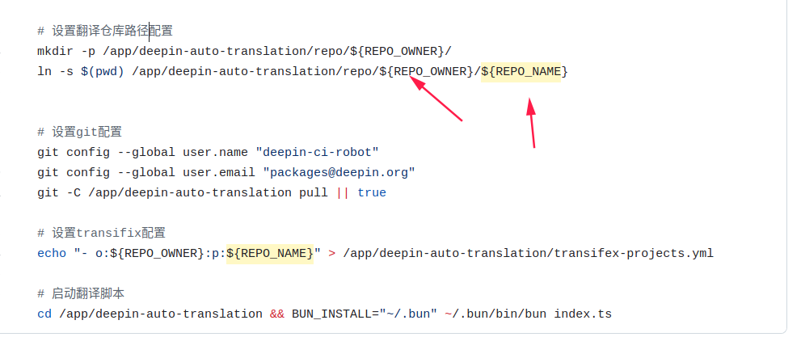
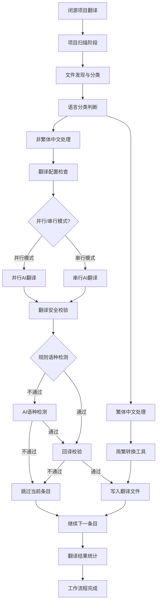

# deepin-auto-translation

在翻译者参与贡献之前，使用 LLM 预先填充 Qt Linguist TS 文件中未翻译的字符串。

预先填充的字符串可被标记为 `type="unfinished"`[^1]，以此让翻译者可以得知这些字符串需要被主动校对。

[^1]: Transifex 平台会忽略被标记为 `type="unfinished"` 的字符串，所以对于此平台上传需求，我们不能保留这个属性。

特别注意：本项目提供了一组脚本和实用函数，用于为基于 Qt 的项目预先填充翻译。由于 LLM 返回的结果并不总是正确和可靠，所以仍然建议在监督的情况下使用此工具。
## 功能特性

- 自动从Transifex平台同步翻译文件更新（开源流程）
- 支持多种大模型翻译服务(DOUBAO, OPENAI等)
- 基于规则库匹配的方式处理繁体中文(zh_HK, zh_TW)翻译，其余语种除有要求的小语种外采用大模型翻译
- **智能语种文件管理**：自动检测并创建缺失的语种文件，确保所有需要的语种都有对应的TS文件
- **并行翻译处理**：支持多文件并行翻译，可通过配置优化翻译性能
- **翻译安全验证**：支持回译验证、语种检测、混合语种检测等多种验证模式
- **语言属性修复**：自动修复TS文件中不正确的language属性
- **翻译内容提取**：支持提取翻译内容用于检查和分析
- 提交翻译结果同步transfix平台（开源流程）

## 开源项目翻译流程

### 前提条件：项目Transifex配置

### 安装Transfiex

```bash
# 安装Transifex CLI
curl -o- https://raw.githubusercontent.com/transifex/cli/master/install.sh | bash
sudo apt install transifex-client

# 配置Transifex认证 (创建 ~/.transifexrc 文件)
[https://www.transifex.com]
rest_hostname = https://rest.api.transifex.com
api_hostname = https://api.transifex.com
hostname = https://www.transifex.com
token = YOUR_TRANSIFEX_API_TOKEN

# 验证安装
tx --version
```

在使用自动翻译工具之前，项目必须已经配置好Transifex集成。项目需要包含以下配置文件：

1. **`.tx/config` 文件**: Transifex CLI配置文件，定义了资源映射关系，例如：
   
   ```ini
   [main]
   host = https://www.transifex.com
   
   [o:linuxdeepin:p:project-name:r:resource-name]
   file_filter = translations/project_<lang>.ts
   source_file = translations/project_en.ts
   source_lang = en
   type = QT
   ```
   
2. **`.transifex.yml` 文件**: Transifex平台的配置文件，用于自动化workflow，例如：
   
   ```yaml
   git:
     filters:
       - filter_type: file
         file_format: QT
         source_file: translations/project_en.ts
         source_language: en
         translation_files_expression: 'translations/project_<lang>.ts'
   settings:
     pr_branch_name: 'transifex-translations'
   ```

**如何配置Transifex集成**：
- 参考文档：[文案国际化配置流程](https://wikidev.uniontech.com/%E6%96%87%E6%A1%88%E5%9B%BD%E9%99%85%E5%8C%96%E9%85%8D%E7%BD%AE%E6%B5%81%E7%A8%8B)
- 项目接入：[项目利用Transifex国际化](https://wikidev.uniontech.com/%E9%A1%B9%E7%9B%AE%E5%88%A9%E7%94%A8Transifex%E5%9B%BD%E9%99%85%E5%8C%96)
- 同步配置：[Transifex翻译同步配置指南](https://wikidev.uniontech.com/Transifex%E7%BF%BB%E8%AF%91%E5%90%8C%E6%AD%A5%E9%85%8D%E7%BD%AE%E6%8C%87%E5%8D%97)
- 工具使用：[Deepin-translation-utils使用说明](https://wikidev.uniontech.com/Deepin-translation-utils%E4%BD%BF%E7%94%A8%E8%AF%B4%E6%98%8E) (可用于生成对应项目的config和transifex.yaml文件)

使用前，务必用tx 命令先测试下是否配置成功，否则无法更新后续代码。（例如 tx pull -a  拉取transifex平台的最新翻译）

### 项目配置文件介绍

在开源项目翻译流程中，除了上述的Transifex集成配置外，还需要配置以下项目级配置文件来控制翻译工具的行为：

1. **config.yml**: 配置Transifex组织信息

   ```yaml
   transifex:
     organization: 'o:linuxdeepin'
   ```

   **作用说明**：

   - 指定翻译工具要连接的Transifex组织
   - CI流程会读取此配置来获取组织下的所有项目列表
   - 确保翻译工具连接到正确的Transifex组织账户

2. **transifex-projects.yml**: 项目列表配置文件（自动生成）

   ```yaml
   - 'o:linuxdeepin:p:deepin-desktop-environment'
   - 'o:linuxdeepin:p:deepin-file-manager'
   - 'o:linuxdeepin:p:deepin-calculator'
   ```




**作用说明**：

- **项目列表配置**：包含需要处理的Transifex项目ID列表
- **自动生成**：在CI流程中，流水线会读取Pr（触发/test deepin-auto-translation的对应pr）中的组织名和项目名并填充到transifex-projects.yml
- **手动配置**：用户可以编辑此文件，添加需要处理的项目，以扩展翻译工具的处理范围

**配置文件工作原理**：

- CI流程启动时首先读取 `config.yml` 获取组织信息。
- 检查是否存在 `transifex-projects.yml` 文件：
  - 如果存在且非空，直接使用其中的项目列表
  - 如果不存在或为空，从Transifex API获取指定组织的所有项目并自动生成此文件
- 用户可以随时编辑 `transifex-projects.yml` 来调整需要处理的项目范围
- 后续步骤从 `transifex-projects.yml` 读取项目信息，获取关联的GitHub资源。

### 使用方法

1. **本地仓库更新源文件**  
   首先需要在项目的本地仓库中合入包含 `_en.ts` 、_en_us.ts、 `zh_CN.ts`、*.ts 的源文件更新(具体请参考.tx中配置的源文件)，这些文件应该按照项目的 `.tx/config` 和 `.transifex.yml` 配置进行更新，然后提交到GitHub并合入主分支

2. **Transifex自动检测变动**  
   Transifex平台会自动监控GitHub仓库，检测到翻译源文件的变化后，会分析翻译完成度的变化(默认翻译pr的触发条件是50%变动，可以找王子冲更改这个数值)

3. **Transifex触发同步PR**  
   检测到变动后，Transifex会自动创建一个同步Pull Request到GitHub项目，PR标题格式通常为：

   `[project-name] Updates for project Project Name #123`

4. **启动自动翻译  
   在由Transifex创建的PR中，使用以下命令触发自动翻译：**

   ```bash
   /test deepin-auto-translation
   ```

   注：如果流水线失败，可使用：

   ```
   /retest
   ```
   
    重启
   
   **参考：https://github.com/linuxdeepin/deepin-draw/pull/150**
   
5. **查看翻译结果**  
   可以在CI执行结果中查看具体的翻译细节和日志，例如：
   [CI执行示例](https://prow.cicd.getdeepin.org/view/s3/prow-logs/pull/linuxdeepin_deepin-draw/143/deepin-auto-translation/1927888385188302848)

### 工作流程详解

开源项目翻译工作流程是本工具的主要功能，专门为处理与GitHub和Transifex平台集成的公开项目而设计。该流程完全自动化，支持CI/CD集成。

#### 工作流程概览


#### CI执行的详细步骤

> **注意**: CI配置基于[deepin-auto-translation/test](https://github.com/linuxdeepin/deepin-auto-translation/tree/develop/test)分支，其他项目如需运行CI，需要基于此分支修改相应的yaml配置文件。

**步骤1：读取配置和项目列表**  

- 读取`config.yml`获取Transifex组织信息
- 检查是否存在`transifex-projects.yml`配置文件：
  - 如果存在且非空，直接使用其中的项目列表
  - 如果不存在或为空，从Transifex API获取指定组织的所有项目并自动生成此文件

**步骤2：项目资源获取**  
- 使用最终确定的项目列表获取所有项目的关联GitHub仓库资源

**步骤3：本地仓库准备**  
- 自动克隆或更新本地仓库到`repo/`目录
- 使用`tx pull --all --force`拉取Transifex最新翻译文件

**步骤4：翻译文件处理**  
- 自动扫描并检查所有翻译文件，识别包含未翻译内容的文件
- 智能分类处理：
  - **繁体中文文件**(zh_HK, zh_TW): 使用规则库匹配方式处理
  - **小语种文件**(如德语、日语等): 跳过不由脚本处理
  - **其他语种**: 使用AI大模型进行翻译

**步骤5：上传翻译结果**  
- 通过`tx push`方式上传翻译后的ts文件到Transifex平台

### 注意事项

- **免费模型限制**: 当前使用免费模型进行翻译，翻译质量可能差强人意。
- **Transifex平台状态**: Transifex平台偶尔会出现响应缓慢的情况，导致API调用失败，建议稍后重试，但概率很小。
- **CI执行失败处理**：CI有时候会因为网速过慢导致执行失败，这种情况使用/retest重新启动流水线即可。
- 项目pr合入建议用Squash merge ，否则会有很多commit记录在git log中。

## 闭源项目翻译流程

### 环境准备

#### **安装bun运行环境**

Bun是一个的 JavaScript 运行环境，旨在提供比现有的解决方案（如 Node.js）更快的执行速度和更高效的资源管理。此外，对于需要快速编写和执行的小型脚本任务，Bun 提供了一个轻量级且高效的选择。无论是文件系统操作、网络请求还是其他 I/O 操作，Bun 都能提供优异的性能表现。

官网地址：https://bun.sh/

安装步骤:

```bash
# 安装bun，有些环境这个命令没法安装bun
# 注意：安装失败的话，就去https://github.com/oven-sh/bun/releases 找安装包手动安装后配置路径到bashrc即可，确保Bun在我们的path中
curl -fsSL https://bun.sh/install | bash

# 添加到PATH (将以下内容添加到 ~/.bashrc)，如果用curl -fsSL https://bun.sh/install | bash则是在这个路径/home/uos/.bun/bin 下找bun命令，手动安装的话也建议参考这个路径
export BUN_INSTALL="$HOME/.bun"
export PATH="$BUN_INSTALL/bin:$PATH"

# 重新加载配置
source ~/.bashrc

# 验证安装
bun --version
```

#### **配置Transifex**

开源项目也可以使用闭源项目的流程进行翻译后上传，对于做过平台同步的项目推荐先进行tx pull更新最新的翻译再进行

```bash
# 安装Transifex CLI
curl -o- https://raw.githubusercontent.com/transifex/cli/master/install.sh | bash
sudo apt install transifex-client

# 配置Transifex认证 (创建 ~/.transifexrc 文件)
[https://www.transifex.com]
rest_hostname = https://rest.api.transifex.com
api_hostname = https://api.transifex.com
hostname = https://www.transifex.com
token = YOUR_TRANSIFEX_API_TOKEN

# 验证安装
tx --version
```

#### 本地AI翻译部署

将项目中根目录中的secrets.sample.ts文件替换名字为secrets.ts，并添加对应大模型的API密钥信息和Model信息：

```c++
// SPDX-FileCopyrightText: 2024 UnionTech Software Technology Co., Ltd.
//
// SPDX-License-Identifier: CC0-1.0
export const doubao = {
    model: 'xxxxxxxxxxxxxxxxxxxxxxxxxxxxxx',
    accessKey: 'xxxxxxxxxxxxxxxxxxxxxxxxxxxxxxxxxxxxx'
};

export const openai = {
    accessKey: 'xxxxxxxxxxxxxxxxxxxxxxxxxxxxxx'
};

export const transifex = {
    accessKey: 'xxxxxxxxxxxxxxxxxxxxxxxxxxxxxx'
}

export default {doubao, openai, transifex};
```

##### 获取大模型API密钥和model方法介绍:

**注：示例中的API均为过期的密钥，仅做示范使用。**

##### 基于火山引擎调用豆包API方法介绍:

登录火山方舟主页 https://www.volcengine.com/product/ark,注册账号并登录:


登录主页后选择API构建应用:


创建API密钥：


创建好,我们点击左侧导航栏的模型广场,选择我们要使用的模型,翻译我们使用的是语言对话模型：


进入大模型使用界面后,点击API接入：


首先获取我们之前创建的API KEY：


点击使用后,会选择接入模型,根据需求选择既可:


开通模型后,根据步骤提示,将API key和model填入secrets.ts文件中既可:


##### 基于硅基流动大模型api调用介绍:

硅基流动（SiliconFlow）提供了一系列API接口，允许开发者调用其大模型进行各种人工智能任务，包括对话生成、文本处理、图像生成、语音和视频处理等。

1.**注册与登录**：

- 用户需要访问硅基流动的官方网站（https://cloud.siliconflow.cn/models）并完成注册，通常通过手机号验证码进行。

2.**API密钥管理**：

- 在硅基流动平台中，用户需要创建API密钥，这是调用API的必要步骤。创建API密钥后，应立即保存，因为某些情况下，创建后的密钥可能不可再次查看。
- API密钥的生成可以在用户账户的API管理页面完成，支持添加描述。


3.创建完密钥后，在主菜单的导航栏中选择模型广场，可以点击筛选选择自己需要的模型：


点击进入模型界面后，点击APi文档按钮,保存model：


4.调用硅基流动API

硅基流动中的模型都可以通过API进行调用，但是如果充值的话，需要进行实名认证才可以往账户里面充值（因为有模型是付费才能使用的，所以需要充值），API调用的方式（QWen2.5模型调用为例），复制步骤2中生成的api密钥和我们在步骤3中选择的model名到secrets.ts文件中，供脚本调用：


翻译模型可以在 `settings.ts` 中进行配置，例如在硅基流程动：

```typescript
export const openai = {
    chatCompletionsEndpoint: "https://api.siliconflow.cn/v1/chat/completions",
    model: "Qwen/Qwen2.5-7B-Instruct" // 可以替换为其他模型
```

##### **Transifex API密钥**配置介绍：

这个密钥不需要我们自己去申请了,wiki上有直接用:

https://wikidev.uniontech.com/%E9%A1%B9%E7%9B%AE%E5%88%A9%E7%94%A8Transifex%E5%9B%BD%E9%99%85%E5%8C%96 查看步骤3

### 使用方法

直接运行以下命令启动翻译流程:
```shell
$ bun closed-source.ts /path/to/project [options]
```

### 命令参数

- **项目路径** (必需): 包含翻译文件的项目目录路径
- **文件列表** (可选): 指定要处理的特定翻译文件
- **--exclude** (可选): 跳过指定的文件，可多次使用
- **--languages** (可选): 指定要翻译的语种列表，用逗号分隔
- **--extract-only** (可选): 只提取翻译内容，不执行翻译
- **--ensure-languages** (可选): 只检测并创建缺失的语种文件，不执行翻译
- **--auto-create** (可选): 自动创建缺失语种文件并执行翻译

#### 使用示例

```bash
# 翻译项目中的所有未完成翻译文件
bun closed-source.ts /path/to/project

# 只翻译特定的几个文件
bun closed-source.ts /path/to/project app_en.ts xx_fr.ts xx_ru.ts

# 翻译所有文件但排除指定的翻译文件
bun closed-source.ts /path/to/project --exclude xx_zh_CN.ts --exclude xx_en.ts

# 只翻译指定语种
bun closed-source.ts /path/to/project --languages zh_CN,en,fr

# 只提取翻译内容用于检查，不执行翻译
bun closed-source.ts /path/to/project --extract-only

# 只检测并创建缺失的语种文件（安全操作）
bun closed-source.ts /path/to/project --ensure-languages

# 自动创建缺失语种文件并执行翻译
bun closed-source.ts /path/to/project --auto-create
```

### 智能语种文件管理

自动检测项目中缺失的语种文件，为缺失的语种创建标准格式的TS文件。

**特性**：
- 支持52种语言的自动创建

      'ca',
      'hu',
      'pl',
      'es',
      'uk',
      'bo',
      'sq',
      'zh_HK',
      'zh_TW',
      'it',
      'pt_BR',
      'az',
      'ug',
      'fi',
      'nl',
      'zh_CN',
      'de',
      'de_DE',
      'fr',
      'cs',
      'tr',
      'en_US',
      'pt',
      'ms',
      'ru',
      'sl',
      'sr',
      'ar',
      'gl_ES',
      'ko',
      'hr',
      'da',
      'ro',
      'krl',
      'lt',
      'id',
      'sk',
      'el',
      'hi_IN',
      'ja',
      'ne',
      'fa',
      'et',
      'bg',
      'sv',
      'am_ET',
      'vi',
      'bn',
      'th',
      'uz',
      'fil',
      'ur',

- 只创建缺失文件，不修改已存在文件

**使用方法**：
```bash
# 只创建缺失的语种文件
bun closed-source.ts /path/to/project --ensure-languages

# 创建缺失文件并执行翻译
bun closed-source.ts /path/to/project --auto-create
```

### 并行翻译处理

支持多文件并行翻译，通过合理配置可优化翻译性能。

**配置方式**：通过环境变量 `TRANSLATION_PARALLEL_CONFIG` 选择预设配置：

```bash
# 标准配置（默认）
export TRANSLATION_PARALLEL_CONFIG=standard
bun closed-source.ts /path/to/project

# 性能配置（高并发）
export TRANSLATION_PARALLEL_CONFIG=performance
bun closed-source.ts /path/to/project

# 保守配置（避免API限制）
export TRANSLATION_PARALLEL_CONFIG=conservative
bun closed-source.ts /path/to/project
```

**配置对比**：

| 配置 | 文件并发 | 批次大小 | API限制 | 特点 |
|------|----------|----------|---------|------|
| standard | 3 | 15 | 3次/1秒 | 平衡速度和稳定性 |
| performance | 5 | 15 | 5次/1秒 | 最大化翻译速度 |
| conservative | 1 | 15 | 1次/2秒 | 串行处理但优化速度 |

### 翻译安全验证

通过环境变量 `VALIDATION_CONFIG` 配置，开启翻译安全验证后，会先基于Unicode字符检测如果检测失败会基于AI进行二次校验，语种检测失败则跳过当前翻译，通过则基于大模型对译文进行回译，并让大模型判断回译和原文是否意思相近：

```bash
# 默认配置（规则+AI语种检测）
export VALIDATION_CONFIG=default
bun closed-source.ts /path/to/project

# 禁用验证
export VALIDATION_CONFIG=disabled
bun closed-source.ts /path/to/project
```

### 工作流程详解

闭源项目翻译工作流程专门为处理无法直接与GitHub和Transifex平台集成的私有项目而设计。

#### 工作流程概览



#### 处理步骤

**第一步：项目扫描**
- 递归扫描项目目录，查找所有 `.ts` 翻译文件
- 识别符合命名规范的翻译文件：`*_语言代码.ts`
- 应用排除规则，跳过不需要处理的文件

**第二步：语言识别和分类**
- 从文件名中提取语言代码（如 `zh_CN`、`en`、`fr` 等）
- 使用 XML DOM 解析器检查文件内容，只处理标记为 `type="unfinished"` 且内容为空的条目
- 智能分类：
  - **AI翻译语种**：英语、俄语、法语、阿拉伯语等
  - **繁体中文语种**：zh_HK（香港）、zh_TW（台湾）
  - **小语种跳过**：德语、日语、西班牙语等

**第三步：翻译处理**
- **非繁体中文文件**：
  1. 使用AI大模型翻译，支持批量处理和并行处理
  2. 对翻译结果进行安全校验：
     - 首先进行规则语种检测
     - 如果规则检测失败，使用AI进行语种检测
     - 通过语种检测后进行回译校验
     - 只有同时通过语种检测和回译校验的翻译才会被写入文件
- **繁体中文文件**：使用 `deepin-translation-utils` 工具进行简繁转换，无需安全校验

**第四步：结果统计**
- 实时显示处理进度和统计信息
- 记录跳过的翻译条目及原因
- 自动生成翻译检查文件用于质量分析

### 与开源项目翻译流程的区别

| 特性 | 开源项目翻译流程 | 闭源项目翻译流程 |
|------|------------------|------------------|
| **触发方式** | GitHub PR + CI评论 | 本地命令行 |
| **数据源** | Transifex平台 + GitHub | 本地文件系统 |
| **配置依赖** | `.tx/config`, `.transifex.yml` | 无需配置文件 |
| **平台集成** | 完全自动化CI/CD | 无平台依赖 |
| **结果输出** | 自动上传并创建PR | 本地文件更新 |
| **适用场景** | 公开开源项目CI/CD | 私有闭源项目本地处理 |

## 资源和链接

### 技术文档
- [Qt Linguist TS 文件格式 XSD](https://doc.qt.io/qt-6/linguist-ts-file-format.html)
- [OpenAI Completions API](https://platform.openai.com/docs/api-reference/chat)
  - [VolcEngine: ChatCompletions API](https://www.volcengine.com/docs/82379/1298454)
  - [vLLM: Structured Outputs](https://docs.vllm.ai/en/latest/usage/structured_outputs.html)
  - [OpenAI Chat Completions: Structured Outputs](https://platform.openai.com/docs/guides/structured-outputs?api-mode=chat&example=chain-of-thought)
- [Ollama API#Structured outputs](https://github.com/ollama/ollama/blob/main/docs/api.md#request-structured-outputs)
- [Transifex OpenAPI](https://transifex.github.io/openapi/)

### Transifex配置参考文档
- [文案国际化配置流程](https://wikidev.uniontech.com/%E6%96%87%E6%A1%88%E5%9B%BD%E9%99%85%E5%8C%96%E9%85%8D%E7%BD%AE%E6%B5%81%E7%A8%8B)
- [项目利用Transifex国际化](https://wikidev.uniontech.com/%E9%A1%B9%E7%9B%AE%E5%88%A9%E7%94%A8Transifex%E5%9B%BD%E9%99%85%E5%8C%96)
- [Transifex翻译同步配置指南](https://wikidev.uniontech.com/Transifex%E7%BF%BB%E8%AF%91%E5%90%8C%E6%AD%A5%E9%85%8D%E7%BD%AE%E6%8C%87%E5%8D%97)
- [Transifex-cli使用指南](https://wikidev.uniontech.com/Transifex-cli)
- [Deepin-translation-utils使用说明](https://wikidev.uniontech.com/Deepin-translation-utils%E4%BD%BF%E7%94%A8%E8%AF%B4%E6%98%8E) (项目配置文件自动生成工具)

